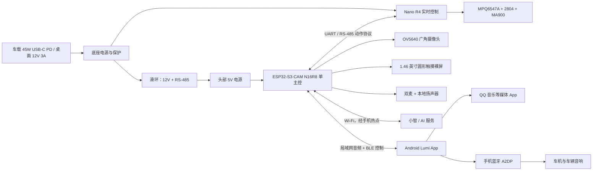

# Lumi 车载陪伴机器人完整可行性方案（V1.0）

> 冻结版本：1.0
>
> 日期：2026-07-17
>
> 阶段：可进入首批采购、原理图与结构预研
>
> 目标车型：比亚迪汉 DM-i；桌面环境先完成完整闭环

## 1. 最终结论

Lumi V1 采用以下冻结架构：

- **头部单主控**：微雪 ESP32-S3-CAM-OV5640（N16R8）同时负责小智 AI、双麦采音、本地扬声器、OV5640 拍照、圆屏表情、触摸和头部通信。
- **显示不再使用第二块 ESP32 主板**：采用 1.46 英寸圆形触摸裸屏，通过自制 FPC 转接板连接摄像头主板。转接板只做引脚映射、背光与必要保护，不承担计算。
- **底座独立实时控制**：Arduino Nano R4 + MA900 + MPQ6547A + 2804 空心轴无刷电机负责 FOC、角度闭环和安全失能。
- **跨旋转机构只传电源和 RS-485**：12V 与 RS-485 通过滑环，摄像头、显示、I2S、USB 等高速信号不经过滑环。
- **手机只承担网络与车载音频网关**：Lumi 自己直连 AI；手机热点提供网络，Android App 把 Lumi 的 TTS 播放到手机 A2DP，再进入车载音响。
- **无手机仍然可用**：没有 App、车载蓝牙或手机热点时，Lumi 仍能本地唤醒、显示表情、转头和用自带扬声器提示；没有网络时不提供云端 AI 对话和云端识图。
- **视觉采用 OV5640 单张主动拍摄**：P0 不做持续录像、追脸和本地视觉模型。

这个方案取消了一块重复的 ESP32-S3 主板和头部板间图片传输，成本、功耗、启动依赖和软件复杂度均低于上一版，适合作为第一台可装车样机的基线。

## 2. 产品范围

### 2.1 P0 必须完成

1. 唤醒、云端语音对话、圆屏表情与触摸交互；
2. Lumi 本地扬声器播放 AI 回复；
3. Android 手机在线且连接车机时，AI 回复通过车载音响播放；
4. 手机断开时自动使用 Lumi 本地扬声器，不影响基本使用；
5. 语音控制当前手机媒体的播放、暂停、上一首、下一首；
6. 单轴平滑转头，支持前、左、右、回正和停止；
7. 用户明确触发后由 OV5640 拍一张照片并进行云端视觉问答；
8. 物理麦克风静音、摄像头遮挡、拍摄指示和底座硬件失能；
9. 桌面与实车供电、掉电、温升、振动和通信安全验证。

### 2.2 P1 暂不进入本轮采购设计

- 免触摸指定歌曲、歌手或歌单搜索；
- 声源定位、持续追脸、连续视频和本地视觉模型；
- 全双工 AEC、播报过程中自然打断；
- CAN/OBD、车辆状态读取及任何车辆控制；
- 多节点无线 OTA；
- 自动判断驻车状态、驾驶员注意力或道路环境。

P1 不得反向增加 P0 的主控、接口和结构复杂度。若以后确实需要连续视觉或强 AEC，再单独评估 Linux SoC，不在本版预埋高成本算力。

## 3. 系统架构



### 3.1 节点职责

| 节点 | 负责 | 明确不负责 |
|---|---|---|
| ESP32-S3-CAM | 唤醒、录音、AI 会话、TTS 路由、显示、触摸、拍照、语义动作 | FOC、电机安全闭环、车辆控制 |
| Nano R4 | FOC、编码器、电流/温度保护、角度轨迹、通信看门狗 | AI、网络、图片处理 |
| Android App | 配对、设置、车载音频网关、媒体控制、状态提示 | 替代 Lumi 录音或运行 AI |
| AI 服务 | 对话、工具决策、单张图片理解 | 直接下发原始电机电压、速度或任意角度 |

## 4. 关键硬件冻结

### 4.1 头部主控、视觉与音频

首选 **Waveshare ESP32-S3-CAM-OV5640，SKU 33699**：ESP32-S3R8、16MB Flash、8MB PSRAM，板载双麦克风、音频编解码/功放和 OV5640。当前小智 ESP32 工程已有该板型和 `self.camera.take_photo` 能力，可在一块板上闭合语音、拍照和 AI 工具调用。

采购时同时买：

- 1 块官方 OV5640 套装板，用默认镜头完成软件点亮；
- 2 个接口、电压和引脚兼容的 24-pin DVP OV5640 广角候选模组，分别测试约 100° 与 120°；
- 不直接把“广角”作为兼容依据，必须核对 FPC 方向、24-pin 排布、供电和时钟。

默认约 68° 镜头可用于开发，但不作为最终装车镜头。最终镜头以实际车内畸变、逆光、人脸覆盖范围和低照度表现选定。

音频沿用主板双麦、ES7210 输入、ES8311/NS4150B 输出链路，扬声器采用 4Ω/3W 小型全频单元。P0 用半双工避免车载音响回灌，不额外采购昂贵麦克风阵列。

### 4.2 圆屏方案

采用 **Waveshare 1.46inch Touch LCD Module 裸屏模组，SKU 34955**，不采购带 ESP32-S3 的集成圆屏主板作为量产结构。

裸屏与摄像头板均具备 QSPI 显示及 I2C 触摸信号，但 **FPC 机械方向和针脚顺序不得假定相同，也不得直接试插**。设计一块小型转接 PCB：

- 按两端原理图逐针映射 VCC、GND、QSPI、复位、背光、TE 和触摸 I2C/中断；
- 增加背光限流/驱动、ESD 和测试点；
- 预留屏幕排线方向调整与摄像头主板固定孔；
- 首版先用转接板飞线/小批 PCB 点亮，再冻结头部结构。

固件以小智官方 ESP32-S3-CAM 板型为基础，合入现有 1.46 圆屏使用的 SPD2010 QSPI 显示与触摸驱动。屏幕仅显示表情、连接状态、静音/拍照状态和少量设置，不承载复杂 UI。

### 4.3 电机与底座

| 部件 | 冻结选择 | 说明 |
|---|---|---|
| 实时 MCU | Arduino Nano R4（ABX00142） | RA4M1 48MHz、5V I/O；便于复用原项目控制路线 |
| 编码器 | MA900 | 单圈绝对角度，3.3V/5V，优先使用带 CRC 的数字接口 |
| 三相驱动 | MPQ6547A 方案板 | 峰值能力不按宣传上限设计，P0 软件目标峰值电流不高于约 1.5A，实测热设计后再调整 |
| 电机 | 原项目同类 2804 空心轴无刷 | 下单前冻结 KV、轴孔、安装孔、额定电压、重量和绕组电阻 |
| 滑环 | 中空微型滑环，至少 8 路 | 2 路 RS-485、至少 4 路供电、2 路备用；孔径和高度先于外壳冻结 |

FOC 驱动、电机和编码器先按原项目组合做裸台验证。若原型号无法明确采购，优先替换电机，不同时更换驱动、编码器和算法，避免故障定位失去基线。

## 5. 接口与协议冻结

### 5.1 头部到底座

ESP32-S3 使用预留 UART（优先 GPIO43/44）连接头部 3.3V RS-485 收发器；滑环传 A/B；底座使用兼容 Nano R4 5V 逻辑的 RS-485 收发器。

电气要求：

- 115200、8N1；双端 120Ω 终端，偏置只在底座一端；
- A/B 增加适合 RS-485 的 TVS，连接器保留 GND 参考；
- 帧包含版本、类型、长度、序号、载荷、CRC16；
- 头部每 50ms 发送心跳，底座 200ms 未收到有效帧即停止并禁能；
- 上电、复位、CRC 错误、越界目标、传感器异常时默认停止。

P0 动作接口只允许：

```text
LOOK_FORWARD | LOOK_LEFT | LOOK_RIGHT | CENTER | STOP
SET_MODE(SAFE | EXHIBITION)
GET_MOTION_STATUS
```

AI 层不得直接控制相电压、电流、转速或无限角度。角度、速度、加速度和最短路径全部由 Nano R4 映射并限幅。

### 5.2 设备与 Android App

| 通道 | 用途 | 约束 |
|---|---|---|
| BLE | 首次绑定、状态、媒体控制、热点提示 | 不传连续音频和图片 |
| 热点内 WebSocket | TTS 音频、播放握手、运行状态 | 仅局域网；带设备绑定令牌和会话随机数 |
| HTTPS/WSS | Lumi 到 AI 服务 | 沿用小智协议和证书校验 |

设备从 DHCP 获取地址后，App 与设备通过已绑定身份发现和连接。不可只依赖固定 IP。Android 新版本需要在 App 中处理本地网络访问权限、BLE 权限、媒体播放前台服务及常驻通知。

## 6. AI、车载音响和手机音乐

### 6.1 AI 直连

ESP32-S3 直接连接手机热点并与小智/AI 服务通信。手机不是必需的语音处理主机，只有“提供互联网”这一网络角色。未来也可以改连家庭 Wi-Fi 或独立随身热点，无需修改 AI 架构。

状态能力如下：

| 网络/App/车机状态 | 可用能力 |
|---|---|
| 有网络、App 在线、A2DP 已连接 | 完整 AI；回复走车载音响 |
| 有网络、App 不在线或 A2DP 未连接 | 完整 AI；回复走 Lumi 扬声器 |
| 无网络 | 本地唤醒、表情、触摸、静音、预设转头和错误提示 |
| 手机完全不在场 | 与无网络状态相同；Lumi 不是完全失效 |

### 6.2 车载音频路由

小智返回的 Opus TTS 帧由 ESP32-S3 接收。在车载模式下，ESP32-S3 通过热点局域网把帧转给 App，App 解码后使用 Android AudioTrack/Media3 播放，Android 再经手机 A2DP 送到车机。

每句话使用一次完整握手：

```text
Device: PREPARE(utteranceId, codec)
App:    READY(A2DP_ROUTE_OK)
Device: START + AUDIO_FRAME...
App:    PLAYING
Device: END
App:    FINISHED
```

- READY 超时或 A2DP 不可用：**整句话**改走本地扬声器；
- 播放中断线：停止本句，不从头重播；可本地短提示“车载音频已断开”，下一句走本地；
- App 不得在车载路由消失时意外外放到手机扬声器；
- 局域网抖动缓冲初值 120～240ms，以实测调优；
- 播报期间申请临时音频焦点，结束后恢复原媒体；
- P0 为半双工：开始播报后暂停语音上传，播放结束后延迟约 300～500ms 恢复监听。

本地扬声器始终存在，不能为了降低成本删除。

### 6.3 QQ 音乐控制边界

P0 的可靠目标是控制 Android 当前媒体会话：播放、暂停、上一首、下一首、恢复。用户首次使用时手动打开 QQ 音乐，并授予 Lumi App 所需的通知/媒体控制权限。

“播放周杰伦的某首歌”涉及 QQ 音乐是否提供稳定的搜索/Deep Link/开放接口，以及 Android 后台拉起限制，不能作为 P0 承诺。P1 可依次验证：

1. QQ 音乐公开 Intent 或 Deep Link；
2. Android Assistant/系统媒体搜索接口；
3. 无稳定接口时，仅让 App 打开搜索结果并要求用户确认，不做脆弱的无障碍自动点击。

音乐较响时，唤醒后设备先要求 App 暂停或压低音乐，最多等待约 300ms 再开始录制；同时提供触摸说话作为兜底。

## 7. 视觉与隐私

P0 只支持以下链路：用户说“拍一下/看看这是什么”或按下拍照键 → 拍摄灯点亮 → OV5640 输出单张 JPEG → 上传 AI → 返回结果 → 默认不在设备或手机持久保存。

硬件与软件要求：

- 摄像头必须有物理遮挡滑盖；
- 麦克风必须有物理静音开关，状态在屏幕上持续可见；
- 拍摄指示灯优先与摄像头使能或供电形成硬件关联，不能只靠 UI 动画；
- 每次拍照使用一次性授权状态，超时自动取消；
- 禁止后台定时拍照、持续录像和默认 TF 卡保存；
- 官方云服务的数据保留策略由服务提供方决定，敏感场景应遮挡摄像头；若后续要求完全自主管理，再评估自建服务；
- 视觉结果不得用于行车、路况、障碍物或驾驶决策。

## 8. 供电与保护

### 8.1 电源树

桌面阶段使用 12V/3A 稳压适配器。装车阶段采用有明确 15V PDO 的 45W USB-C PD 车充，通过 PD 诱骗/受电模块取得 15V：

```text
15V 输入
├─ 输入保险/PTC、反接、TVS、过压/欠压
├─ 12V 稳压轨 → 电机驱动
├─ 5V 稳压轨  → Nano R4 与底座通信
└─ 12V 经滑环 → 头部 5V/3A 降压 → S3、摄像头、屏幕、音频
```

不把车充输出的变化电压直接送入头部敏感器件。装车前必须实测汉 DM-i 供电口在启动、熄火和长时间停车时的行为。

### 8.2 设计功率预算

| 负载 | 设计峰值 | 备注 |
|---|---:|---|
| 头部 S3、OV5640、双麦、圆屏、3W 扬声器 | 5V / 2.0A，预留至 2.5A | 约 10～12.5W |
| 电机与驱动 | 12V / 1.5A | P0 限流目标，堵转时必须硬件/软件切断 |
| 底座逻辑与损耗 | 约 2～4W | 含降压与通信 |
| 整机 | 约 30～35W 峰值设计 | 45W 输入留有余量 |

滑环单个供电回路应能承受整机正常头部电流。只有厂家明确允许时才并联多回路增流，设计不能依赖不均流的细导线勉强承载。建议 2 路正、2 路负、2 路 RS-485、2 路备用，实际规格在结构开模前冻结。

### 8.3 失效安全

- 电机 EN 默认下拉，MCU 未启动或复位时驱动关闭；
- 欠压、过温、编码器失联、RS-485 超时和控制循环异常均直接禁能；
- 驱动附近放置母线电容、陶瓷去耦和温度检测；电机与逻辑电源分支布线；
- 不使用内置锂电池，不在高温停车时持续供电；
- 掉电时先硬件失能电机，不依赖文件保存或完整软件关机。

## 9. 机械、热与车内安全

### 9.1 结构原则

- 先采购并实测滑环、电机、主板、裸屏和扬声器，再冻结外壳；
- 电机、轴承、滑环和底座由螺钉连接形成承力骨架，外壳卡扣只负责覆盖；
- 采用“车型曲面适配底板 + 机械快拆座”，机器人本体不只靠普通双面胶；
- 放置在中控低矮区域，避开驾驶视野、气囊展开区、除雾/空调出风口和车机操作区；
- 线束设应力释放，旋转件与固定件之间留防夹间隙；
- 个人 DIY 样机不宣称碰撞安全，实车测试必须先低速、短时、有人监护。

建议把头部质量控制在 350g 以内、重心距旋转轴小于 20mm，整机高度优先控制在约 140mm 内。这些是结构目标，不是采购器件前的硬性尺寸；应先用纸板/3D 打印模型在实车确认。

### 9.2 热设计

头部增加数字温度传感器，底座驱动附近增加 NTC。外壳保留隐藏式上下对流通道，S3、电源和功放避免堆叠；深色外壳在挡风玻璃下需额外评估日晒。

首版保护阈值建议值：

- 头部 ≥60°C：屏幕降亮、限制电机动作；
- ≥70°C：关闭相机并禁能电机，仅保留报警；
- ≥75°C：整机受控关闭；
- 降至 55～60°C 以下再允许恢复。

阈值必须结合各器件额定温度和车内热箱试验修订，不能直接视为量产定值。

## 10. 运动与交互状态

每次上电默认进入 `SAFE`，不记忆表演模式：

| 模式 | 行为 |
|---|---|
| SAFE | 只允许有限左右角度、低速低加速度、最短路径；适合车辆环境 |
| EXHIBITION | 允许更大幅度动作；只能在 App/屏幕明确开启，60s 无操作自动退出 |
| FAULT | 电机禁能，屏幕显示故障码，必须故障消除后重新确认 |

建议初始参数：SAFE 最大约 30°/s、加速度 60°/s²；EXHIBITION 最大约 90°/s。最终值由头部惯量、噪声、滑环和实车观感决定。

车辆正前方在装车后校准一次并保存软件偏移。MA900 提供单圈绝对角度；常规动作走最短路径。P0 没有 CAN/OBD，Lumi 不能自行知道车辆是否驻车，因此表演模式只能由用户主动开启。

## 11. 分批采购清单

价格仅作为 2026-07 的样机预算参考，官方件以官网价为基准，其余随渠道变化；下单前再次核对型号、接口和库存。

### A 批：立即采购，用于消除核心风险

| 物料 | 数量 | 参考单价 | 采购备注 |
|---|---:|---:|---|
| Waveshare ESP32-S3-CAM-OV5640 SKU 33699 | 2 | 约 ¥109～150 | 1 开发、1 备份；必须 N16R8/OV5640 版本 |
| Waveshare 1.46inch Touch LCD Module SKU 34955 | 2 | 约 ¥120～150 | 裸屏，不是带 S3 的集成开发板 |
| 兼容 OV5640 广角模组 | 100°/120° 各 1 | 约 ¥40～100 | 24-pin DVP，先确认引脚与电压 |
| Arduino Nano R4 ABX00142 | 2 | 约 ¥110～140 | 官方或可靠渠道 |
| MA900 编码器板/磁铁 | 2 套 | 约 ¥40～100 | 确认安装间距与接口 |
| MPQ6547A 驱动板 | 2 | 约 ¥80～180 | 优先原项目同版；保留测试点和 EN |
| 2804 空心轴电机 | 2 | 约 ¥60～120 | 先确认 KV、孔径、安装孔和绕组参数 |
| 3.3V/5V RS-485 收发与保护样件 | 各 3 套 | 约 ¥30～80/批 | 含终端、TVS；头/底逻辑电平不同 |
| 4Ω/3W 扬声器 | 2～3 | 约 ¥10～30 | 选择薄型全频，比较腔体效果 |
| 12V/3A 桌面电源 | 1 | 约 ¥50～100 | 首轮不要直接上车供电 |

**A 批通过门槛**：单板 AI/双麦/扬声器/OV5640 均工作；裸圆屏通过转接验证点亮并可触摸；FOC 裸台稳定；RS-485 连续通信通过。任何一项失败，暂停 B/C 批结构采购。

### B 批：接口验证后采购

| 物料 | 数量 | 参考预算 | 前置条件 |
|---|---:|---:|---|
| 小批 FPC 转接 PCB + 排线 | 5 套 | ¥100～300 | 两端原理图逐针复核完成 |
| 8 路以上中空滑环候选 | 2 种各 1 | ¥100～300 | 电流、孔径、高度与噪声要求明确 |
| 45W USB-C PD 车充 + 15V 受电模块 | 2 套 | ¥100～250 | 有明确 15V PDO，保护方案已定 |
| 12V/5V 降压、输入保护器件 | 2～3 套 | ¥100～250 | 完成最大负载预算 |
| 温度传感器、NTC、保险、TVS、连接器 | 2 套 | ¥80～200 | 原理图第一版完成 |
| 结构紧固件、轴承、线束 | 2 套 | ¥100～250 | 电机与滑环实物尺寸已量取 |

### C 批：功能样机通过后采购

- 定制底座/电源/通信 PCB；
- 头部与底座 3D 打印件、透明屏盖、摄像头滑盖；
- 汉 DM-i 曲面适配底板和快拆座；
- 最终选定的广角 OV5640、滑环、电机及备件；
- 线束、屏蔽、粘接与汽车内饰材料。

整机第一台可装车样机预计 **¥900～1500**，不含手机、开发工具和反复打样；若大量使用已有器件可更低。建议先批准 A 批约 ¥800～1300，不一次性购买最终外壳与定制板。

## 12. 开发阶段与退出门槛

### 阶段 1：单板头部闭环

- 合并摄像头板与 SPD2010 圆屏驱动；
- 完成唤醒、AI、本地 TTS、触摸、表情和单张拍照；
- 测试广角镜头、逆光、夜间、音量和温升。

退出门槛：连续 30 分钟对话无重启；30 秒 TTS 无明显断音；拍照触发、指示、上传和返回完整可用。

### 阶段 2：运动底座与滑环

- 完成 FOC、MA900 绝对角度、动作轨迹和故障保护；
- 加入 RS-485 帧、CRC、心跳和超时停机；
- 用等效头部质量完成旋转寿命和供电压降测试。

退出门槛：任何头部断电/复位/通信丢失均在 200ms 内停止；无失控旋转；10,000 次动作循环后通信与供电正常。

### 阶段 3：Android 音频网关

- 完成绑定、局域网发现、音频握手、A2DP 路由和媒体控制；
- 验证 App 后台、锁屏、来电、蓝牙断开、热点切换和进程重启；
- 本句与下一句的回退策略严格按第 6.2 节执行。

退出门槛：App 或车机断开后 1 秒内识别，下一句可靠走本地；连续 30 分钟播报无路由串错；音乐能恢复。

### 阶段 4：整机与装车

- 先用尺寸模型确认位置，再装功能样机；
- 测试车辆启动/熄火、电压波动、蓝牙重连、振动、反光、日晒温升和电磁干扰；
- 完成快拆、线束应力释放、遮挡和静音机构。

退出门槛：100 次断电重启无自行转动；连续 8 小时桌面运行无安全故障；实车短途测试无视野、气囊、出风口或操控干涉。

## 13. 量化验收指标

| 类别 | P0 验收目标 |
|---|---|
| 启动 | 本地 UI/安全控制 ≤5s；联网 AI 就绪通常 ≤20s，受热点影响 |
| AI 延迟 | 用户说完到本地首音目标 ≤2.5s；网络异常需给出状态提示 |
| 车载音频 | 相比本地额外延迟目标 ≤500ms；30s 播放无明显欠载 |
| 回退 | App/A2DP 断开识别 ≤1s；下一句 100% 使用本地扬声器 |
| 视觉 | 拍照生成 JPEG ≤2s；拍照到回答目标 ≤8s，标注网络相关 |
| 运动 | 稳态角度误差 ≤2°，超调 ≤5°，静止无持续抖动/啸叫 |
| 安全 | 心跳丢失到电机停止 ≤200ms；上电和复位不得自行运动 |
| 通信 | 8 小时连续运行无不可恢复断链；CRC 错误可统计且不执行坏帧 |
| 滑环 | 头部最大负载下压降目标 <0.5V、温升 <15°C；10,000 次动作后复测 |
| 电源 | 100 次上下电无配置损坏、无失控动作，过流/欠压能安全恢复 |
| 热 | 达阈值时按降级表执行，无外壳烫伤风险；最终以实测修订阈值 |

## 14. 主要风险与降级方案

| 风险 | 预防 | 失败时降级 |
|---|---|---|
| 裸圆屏与摄像头板引脚/驱动不兼容 | 转接 PCB、逐针复核、小批点亮 | 临时使用集成 1.46 圆屏板做独立 HMI，但不作为首选量产架构 |
| 单 S3 同时跑 AI、相机和屏幕内存紧张 | N16R8、单张 JPEG、限制分辨率和 UI 缓冲 | 拍照时暂降动画帧率；仍不加第二块图像 MCU |
| 广角 OV5640 兼容性差 | 默认镜头先点亮，采购两种候选 | 保留默认 68° 镜头，通过电机转向补偿 |
| 车载蓝牙路由不稳定 | 握手确认 A2DP、前台媒体服务、整句路由 | 永久保留本地扬声器 |
| QQ 音乐不能指定点歌 | P0 只依赖标准媒体会话 | 打开搜索页由用户确认；不做无障碍模拟点击 |
| 车载音响导致回声 | P0 半双工、唤醒后先暂停音乐 | 触摸说话；AEC 放入 P1 |
| 滑环压降/噪声/寿命不达标 | 两种候选实测、头部本地降压与滤波 | 降低头部峰值音量，换高电流滑环 |
| 电机热或头部惯量过大 | 1.5A 保守限流、质量/重心目标 | 降速降加速度，换更高扭矩低 KV 电机 |
| 车内高温 | 温度传感、降级、停车断电 | 禁止高温运行，改浅色外壳与加强散热 |
| 云端隐私不可控 | 主动单拍、物理遮挡、默认不存 | 敏感场景不用视觉；后续自建服务 |

## 15. 进入设计环节前的冻结输出

采购 A 批后，设计阶段按以下顺序产出，不应直接从外观建模开始：

1. 《器件实物尺寸与接口测量表》；
2. 《头部主控—圆屏转接板逐针连接表》；
3. 《整机电源树、峰值功耗与保护原理图》；
4. 《Nano R4—驱动—MA900—RS-485 底座原理图》；
5. 《RS-485 帧协议与故障状态表》；
6. 《Android 音频路由状态机与权限清单》；
7. 《头部重心、轴承、滑环、快拆结构堆叠图》；
8. 《桌面测试记录与 P0 验收报告》；
9. 前八项通过后再冻结外壳、车载适配底板和最终 BOM。

## 16. 采购前最后核对清单

- [ ] ESP32-S3-CAM 商品页明确为 OV5640、16MB Flash、8MB PSRAM；
- [ ] 圆屏为 SKU 34955 裸屏模组，不是集成 ESP32 开发板；
- [ ] 广角 OV5640 的 24-pin 排布、电压、排线方向与主板一致；
- [ ] 2804 的 KV、空心轴孔径、安装孔和绕组参数有数据；
- [ ] MA900 板包含合适磁铁，并能满足轴向间距；
- [ ] 滑环单路电流、孔径、高度、回路和寿命有书面规格；
- [ ] PD 车充明确支持 15V PDO，不只标总功率；
- [ ] 不在 A 批阶段采购最终外壳、批量 PCB 或大量同型号滑环。

## 参考资料

1. [小智 ESP32 官方工程](https://github.com/78/xiaozhi-esp32)
2. [小智 MCP 使用与设备工具](https://github.com/78/xiaozhi-esp32/blob/main/docs/mcp-usage.md)
3. [Waveshare ESP32-S3-CAM-OVxxxx 文档](https://docs.waveshare.com/ESP32-S3-CAM-OVxxxx)
4. [Waveshare ESP32-S3-CAM-OV5640 产品页](https://www.waveshare.com/product/esp32-s3-cam-ov5640.htm)
5. [Waveshare 1.46inch Touch LCD Module](https://www.waveshare.com/product/displays/lcd-oled/1.46inch-touch-lcd-module.htm)
6. [Arduino Nano R4 官方文档](https://docs.arduino.cc/hardware/nano-r4/)
7. [MA900 官方资料](https://www.monolithicpower.com/en/ma900.html)
8. [MPQ6547A-AEC1 官方资料](https://www.monolithicpower.cn/cn/mpq6547a-aec1.html)
9. [MPS 桌面智能机器人开源项目](https://forum.monolithicpower.cn/t/topic/7513)
10. [Android 本地网络权限](https://developer.android.com/privacy-and-security/local-network-permission)
11. [Android 后台媒体播放](https://developer.android.com/media/media3/session/background-playback)
12. [Android BLE 后台通信](https://developer.android.com/develop/connectivity/bluetooth/ble/background)

---

**方案冻结说明**：V1.0 已足够进入 A 批采购与电气/结构预研，但不代表可直接装车长期使用。最终外壳、滑环、广角镜头、电机限流和热保护阈值必须以实物验证结果冻结；涉及驾驶环境的能力始终以安全降级和本地扬声器兜底为前提。
