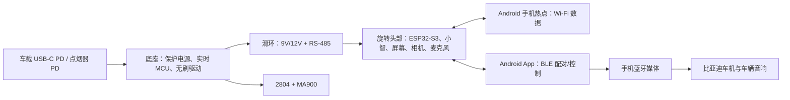

# Lumi 车载陪伴机器人可行性方案（V1）

> 版本：0.3｜2026-07-11｜个人 DIY 基线方案

## 1. 定位与边界

Lumi 是类似 NOMI 的实体化座舱 AI 伙伴：能听、说、看向用户、显示表情、拍照识图。

V1 针对**比亚迪汉 DM-i**验证，采用**单轴无刷 FOC 无限旋转 + 滑环**。汽车只提供电力；Lumi 通过 Android 手机获得网络与车载音响输出，**不读取或控制车辆**。

不做 CAN/OBD、门锁、空调、车窗及任何驾驶或安全关键功能；不默认保存/上传车内音视频；视觉结果仅供参考，不用于驾驶决策。

## 2. V1 功能

- 圆形屏幕表情、触摸、唤醒与语音对话；
- 单轴无限平滑转头，看向声源或前/左/右预设方向；
- 一颗随头部转向的广角低照度摄像头，支持用户主动拍照与地标问答；
- 2 麦或 4 麦阵列、物理静音键、摄像头物理遮挡滑盖与拍摄指示灯；
- Android App 负责配网、设置、相片查看和 OTA；
- 离线仅保留唤醒、静音、表情、转头和安全控制；联网后提供小智对话与视觉识图。

驾驶中低亮、低频动作，不持续追脸；完整转圈只在驻车时由用户主动触发。

## 3. 原项目复用

原项目已验证 ESP32-S3 屏幕、小智 AI、OpenMV N6、无刷 FOC、MA900、MPQ6547A 与滑环。[原项目](https://forum.monolithicpower.cn/t/topic/7513)

V1 最大化复用这些模块：屏幕/小智、OpenMV N6、Arduino（或等效实时 MCU）、MPQ6547A、MA900 和 2804 电机先独立工作，通过安全通信联调；稳定后再决定是否合板。外观卡扣可借鉴原项目，但承力骨架、电机和底座必须螺钉固定。

P0 冻结选用**ESP32-S3 + OpenMV N6 + 原项目圆屏**：V1 仅拍摄单张图片并上传云端识图，不需要本地视觉模型；Linux SoC 留到后续连续视频、复杂 AEC 或本地视觉需求出现时再评估。原圆屏先用于验证表情、日照可见性和温升，实车不达标后再升级高亮屏。

MPQ6547A-AEC1 是电机驱动候选，但器件车规资质不等同于整机车载可靠性。[器件资料](https://www.monolithicpower.cn/cn/mpq6547a-aec1.html)

## 4. 架构与通信

- 底座实时 MCU 负责 FOC、编码器、电流/温度、看门狗和失能；头部异常时仍可安全停机。
- 屏幕、摄像头、麦克风、Wi-Fi 与交互主机全部在旋转头部；高速图像/显示/USB/I2S 信号**不得**跨越普通滑环。
- 滑环只传经保护的 9V/12V 电源及 RS-485 低速差分通信；通信带 CRC、心跳与超时，断线即停机。
- AI 只能调用 `LOOK_FORWARD`、`LOOK_LEFT`、`LOOK_RIGHT`、`CENTER` 等动作名；实时 MCU 决定角度、限速和安全保护。

## 5. 手机网络与车载音响（P0 已定）

Android 手机开启个人热点，Lumi 自动连接已保存的 SSID 和密码，通过 Wi-Fi 传输语音流、图片和 AI 结果。BLE 只用于配对、控制和状态。

手机保持为车机唯一蓝牙媒体音源：Android App 将 Lumi 的回复播放到车辆音响，并在播报时申请音频焦点、压低或暂停音乐，结束后恢复。

普通 Android App 不能可靠自动开启热点，因此用户上车后需手动开启热点；热点名称/密码应固定，并关闭无设备连接自动关闭。App 可经 BLE 发现 Lumi，并在热点未开时提示用户。

## 6. 机械、滑环与供电

Lumi 安装于中控前排低矮区域，避开气囊、除雾口、驾驶视野及屏幕操作范围。采用“车型曲面适配底板（汽车级泡棉胶）+ 机械快拆座（卡口/螺钉）”；普通双面胶不直接粘机器人本体，且个人样机不宣称碰撞安全。

采用至少 8 路的中空微型滑环：电源正负各两路并联、两路 RS-485，其余备用。头部在滑环后本地滤波并降压为 5V/3.3V。采购前确认孔径、高度、回路、额定电流和安装方式，再反推外壳。

不使用锂电池。先验证汉 DM-i 的供电口是否随熄火断电；掉电时硬件欠压检测让 MCU 先失能电机，再完成安全关机。输入端配置保险丝/PTC、反接、浪涌、过压与欠压保护。

## 7. 交互规则

| 动作 | 行为 |
|---|---|
| 倾听 | 显示倾听表情，缓慢看向声源或指定方向。 |
| 回答 | 回正或微动，表情与语音同步，避免连续摆动。 |
| 拍照 | 转向前/左/右，亮起拍摄灯，拍摄后回正。 |

装车后设置一次“车辆正前方”并保存软件偏移。MA900 的单圈绝对角度据此计算动作目标，不需要机械限位或每次回零。常规交互走最短路径；驻车表演才允许完整转圈。

车载音响会被麦克风再次采集。P0 使用半双工：手机开始播报时经 BLE 通知 Lumi 暂停语音采集和唤醒；播报结束后延迟 300–500 ms 再恢复。后续再考虑 AEC 与打断检测。

## 8. 验证顺序与验收

1. **裸旋转台**：2804、MA900、驱动板与滑环连续运行；装上屏幕、OpenMV、头部电源板及等效外壳重量，测试供电压降、RS-485 错误率、接触噪声、相机/屏幕稳定性及至少 10,000 次旋转寿命。
2. **桌面交互闭环**：表情、唤醒、小智、拍照视觉问答、预设动作与半双工回声抑制。
3. **汉 DM-i 装车验证**：先用纸板/3D 尺寸模型确认视野、反光、出风口和安装位置；再验证启停、熄火、颠簸、温升、车载蓝牙播报与音乐恢复。
4. **外壳与底座**：仅在前三项通过后锁定尺寸与结构。

## 9. 待定项

- 中控台具体安装点与尺寸包络；
- 摄像头、麦克风阵列、滑环的实际型号；
- P0 后是否需要因连续视频、复杂 AEC 或本地视觉升级 Linux SoC。

## 参考

1. [MPS 桌面智能机器人开源项目](https://forum.monolithicpower.cn/t/topic/7513)
2. [MPQ6547A-AEC1](https://www.monolithicpower.cn/cn/mpq6547a-aec1.html)
3. [蔚来 NOMI 用户手册](https://cdn-public.nio.com/www-nio-cn/user-instructions/ES7/index.html)
